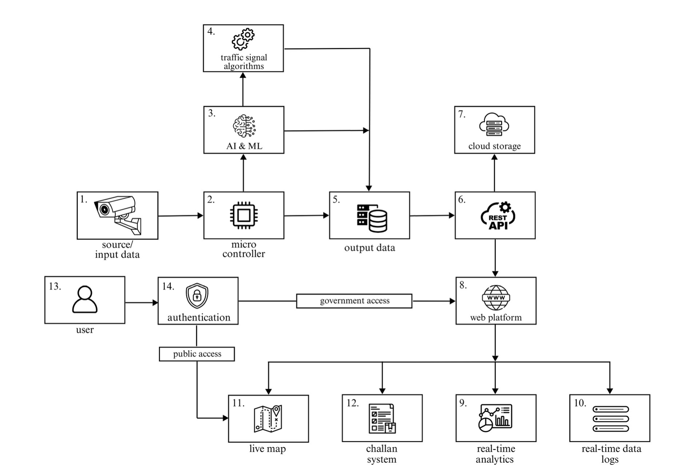
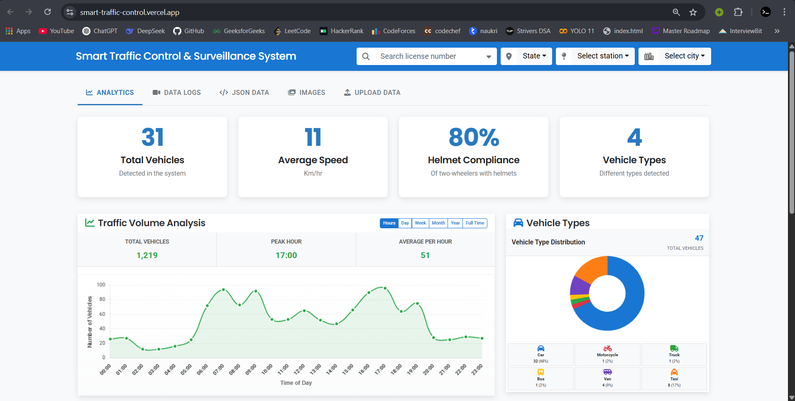
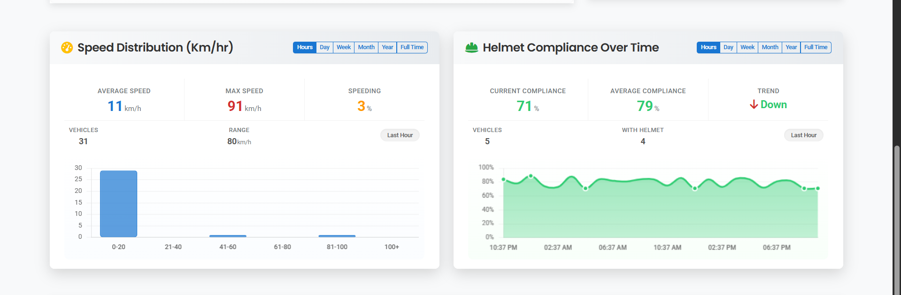
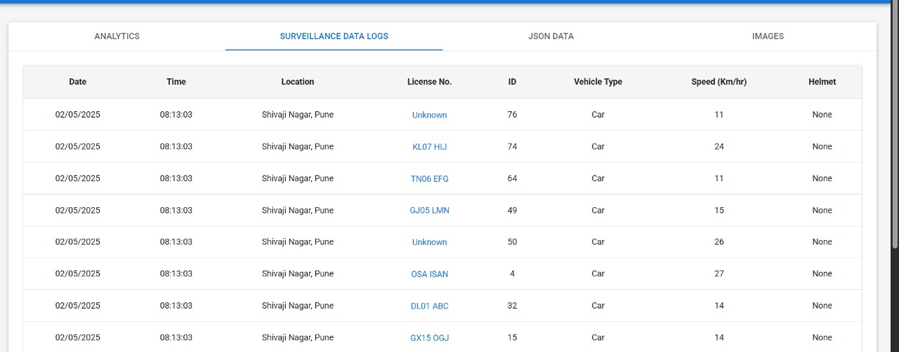
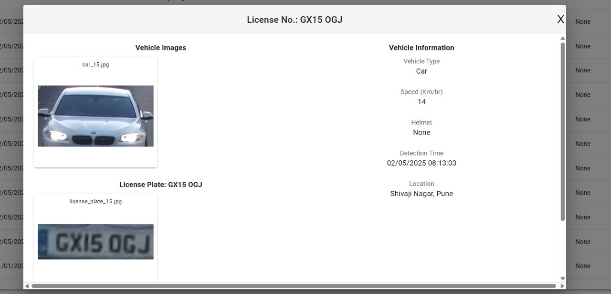
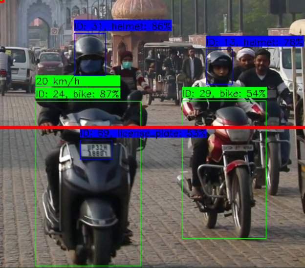
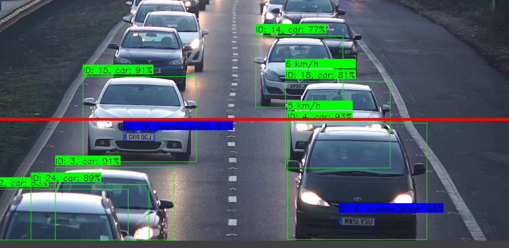

# 🚦 Smart Traffic Control & Surveillance System </h2>

An **AI**-powered real-time multitasking system using advanced **custom trained** machine learning model (**YOLOv11**) and **OpenCV**. **Raspberry Pi** and camera modules for edge computing, It detects and classifies vehicles such as (**bike, car, bus, truck**), monitors **helmet usage, measures speed**, automatic number plate recognition (**ANPR via OCR & Google Cloud Vision API**), detects **emergency vehicles like ambulance and fire brigade**. The system dynamically adjusts traffic signals based on real-time traffic density and **prioritize emergency vehicles** by green signal and speakers announcement. All capture data including vehicle images, license plate, speed, location, helmet status and red signal break. are securely uploaded on **cloud** and **web platform** on real-time using **web socket** and **Rest API**, The web platfrom is specially designed for **government** use. It provides real-time analytics, detailed vehicle logs, automatic **challan generation** system with proof like detected vehicle image, speed, helmet status, license plate.   

<!-- 🔗 Quick Links (Top-left) -->
<h4 align="left">🔗 Quick Links</h4>
<div align="center">

  <a href="https://smart-traffic-control-and-surveilla.vercel.app">
    
  </a>
  
  <a href="#">
    
  </a>

  <a href="#">
    
  </a>

  <a href="#">
    
  </a>

</div>  

```

Note: Prototype & Patent are in progress...
```

---

## 🧠 Problem Statement

➔ **Real world traffic problem:** Due to exponential growth of vehicles, traffic increasing day by day and  Conventional traffic signal systems rely on fixed timers or rudimentary sensors, leading to inefficiencies such as prolonged congestion, fuel waste, and increased emissions.

➔ **Raising Traffic Violations:** Helmet-less riding, signal jumping, and triple riding are rampant in many cities. Manual enforcement is ineffective and resource-intensive. Our system automatically detects violations using machine learning (YOLO model), improving enforcement efficiency.

➔ **Emergency Response Delays:** Congestion and poor traffic flow slow down emergency vehicles. By monitoring real-time traffic, the system can be scaled to prioritize emergency vehicle movement and dynamically manage signals.

➔ **Lack of Centralized Data:** Current systems don’t store violation data for easy access or reporting. Our solution uploads detected violations to the cloud, enabling officials to track offenders via license plate recognition and access reports through a web interface.

---

## ✅ Approach & Solution

➢ Deploy Raspberry Pi with camera modules at traffic signals to capture real-time video using edge computing.  

➢ Use custom-trained YOLOv11 model for vehicle detection and classification (bike, car, bus, truck), directly on edge devices.  

  - Helmet, Speed, Emergency vehicle, Red light violation detection.  
  - Automatic Number Plate Recognition (ANPR) with EasyOCR and Google Cloud Vision API.  

➢ Develop an algorithm to control traffic signals dynamically by:

  - Prioritizing high density traffic with dynamic countdown.
  - Prioritizing emergency vehicles by granting immediate green signals.

➢ Securely upload all surveillance data including vehicle images, license plates, speed, helmet status, and violations to cloud storage and a web platform in real-time via RESTful APIs.

➢ Build a web platform with features like:

  - Real-time analytics and filteration option by state and city.

  - Vehicle number plate search bar for detailed info. (logs, images, and top recorded stats).

  - Automated challan (fine) generation system for violations.

  - Live map displaying traffic signals, traffic density, and countdown timers.

  - Advanced authentication and strict data privacy, for government access only.
    
---

## ⚡ Features

-  **Dynamic traffic signal control** based on real-time vehicle density  
-  **Automatic emergency vehicle prioritization**  
-  **Vehicle detection with classification (bike, car, bus, truck, etc.)**  
-  **Helmet , speed, red light violation detection**
-  **Automatic number plate recognition (ANPR)**  
-  **Real-time data sync via RESTful APIs to cloud and web dashboard**
-  **Real-time analytics dashboard with filterations according to state & cities** 
-  **Searchable logs by license number, location, date, etc.**  
-  **Live maps, heatmaps, analytics graphs for traffic & violations**  
-  **Automatic challan generation with violation proof**  
-  **Advanced 3-level authentication for government users**  

---

## 🧰 Tech Stack

| Layer         | Tools/Technologies Used |
|---------------|-------------------------|
| **Frontend**  | React, Next.js, Google Maps API |
| **Backend**   | Node.js, Express.js, RESTful APIs, socket.io |
| **AI/ML**     | Custom YOLOv11, OpenCV, EasyOCR, Google Cloud Vision API |
| **Hardware**  | Raspberry Pi, Camera Modules, I2C LCD |
| **Dev Tools** | Google Cloud Platform (GCP), Google Colab, MongoDB, OAuth 2.O |

---
## System Architecture
 
## 🖼️ Screenshots

| Dashboard |
|----------|
|   |  |

| License Plate Logs | Vehicle info |
|--------------------|--------------|
|  | 

| Detection demo 1 | Detection Demo 2 |
|---------------------|----------------------------|
|  |  |

---
## 🌍 Applications

### 1.  Automated Traffic Signal Control
- Dynamically adjusts signal timings based on real-time traffic density.
- Prioritizes lanes with high congestion and emergency vehicles (ambulances/fire brigades).
- Sets countdown timers adaptively for each lane to optimize traffic flow.

### 2.  Real-Time Traffic Surveillance
- Continuous 24/7 monitoring using Raspberry Pi and cameras.
- On-device edge processing for faster detection and reduced latency.
- Enables authorities to remotely observe and manage traffic behavior.

### 3.  Intelligent Traffic Law Enforcement
- Detects helmet-less riding, red-light jumping, and overspeeding.
- Uses YOLOv11, OpenCV, and EasyOCR for real-time violation tracking.
- Automatic challan generation with timestamped visual proof.

### 4.  Emergency Vehicle Management
- Identifies ambulances and fire brigades in real time.
- Automatically switches signals to green in their path for rapid clearance.
- Helps improve emergency response time and save lives.

### 5.  Cloud-Based Centralized Data Management
- Real-time upload of detected violations (images, license plates, speed, etc.) to Google Cloud.
- Provides a secure, scalable, and redundant data backup system.
- Enables centralized access for RTO and law enforcement departments.

### 6.  Government Web Portal for Analytics
- Real-time dashboard with violation logs and data filters (by state, city, region).
- License plate search with complete vehicle history and offenses.
- Enables efficient, data-driven decision making for enforcement agencies.

### 7.  Real-Time Traffic Analytics & Heat Mapping
- Live map with traffic signal status, countdown timers, and congestion zones.
- Heatmaps showing density trends across regions and time intervals.
- Assists in congestion prediction and traffic planning.

### 8.  Automatic Challan System
- Generates challans automatically for violations with proof (image, location, time).
- Reduces manual enforcement efforts and improves accuracy.
- Sends notifications to registered vehicle owners.

### 9.  Secure Role-Based Access Control
- Public users can access live maps and traffic updates.
- Government officials have full control with multi-step secure authentication.

### 10.  Urban Planning & Smart City Integration
- Uses historical traffic data to identify problem zones.
- Helps design better road layouts, signal placements, and traffic rules.
- Seamlessly integrates with smart city infrastructure.

### 11.  Legal Evidence for Dispute Resolution
- Surveillance data (images, timestamps) can be used in legal claims or traffic disputes.
- Increases transparency and accountability in traffic enforcement.

### 12.  Research & Academic Use
- Datasets generated from real-world scenarios can be used to train AI models.
- Enables academic research in smart transportation, urban planning, and computer vision.


## 🚀 Run Instructions

### ⚙️ Prerequisites
- Node.js
- Python 3.x
- Raspberry Pi (for hardware-side setup)
- Google Cloud credentials & API access (Vision API, GCP bucket)

### 🖥️ Backend Setup

```bash
cd backend
npm install
npm start
